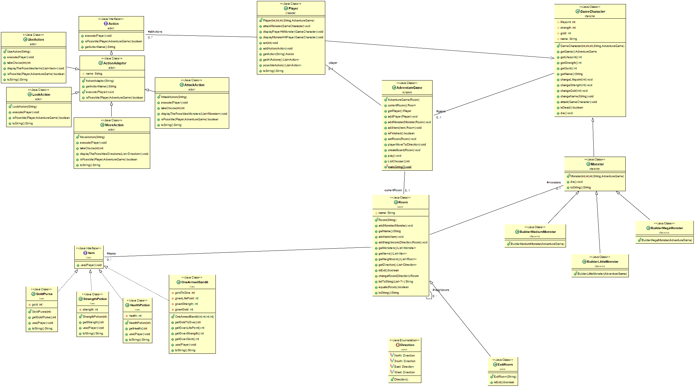

<h2> Participants au projet : </h2>

TESTELIN Adil

DEBROUCKER Tommy

Groupe 1 L3 MIAGE. (Projet Universitaire)

<h1> Projet Donjon. </h1>

<h3> Rapide introduction au sujet : </h3>
Dans ce jeu le joueur parcourt les différentes salles d’un donjon. Lorsqu’il arrive dans une salle le joueur peut choisir une action à executer parmi la liste des actions possibles à ce moment là dans cette salle. Une salle peut contenir des objets et être habit ee par un ou plusieurs monstres. Les objets peuvent être utilisés par le joueur.  Si le joueur rencontre un monstre, il faudra alors le tuer pour pouvoir quitter la  salle qu’il  habite.   Evidemmment le monstre peut riposter s’il est attaqué. L’objectif du joueur est d’atteindre (vivant) la sortie du donjon, une salle particulière. A l’inverse le joueur perd le jeu s’il meurt avant d’atteindre la sortie.

<h2> Rubrique How To : </h2>

* Afin de récupérer le projet, il est nécessaire d'utiliser la commande suivante :
**git pull** puis se placer dans le répertoire TP_dungeon.

* Ensuite pour générer la documentation, il convient d'utiliser la commande :
**mvn javadoc:javadoc** afin que la javadoc soit générée au format HTML dans le répertoire /target/docs/.

* Ensuite afin de générer le projet, la commande est la suivante :
**mvn package** à la racine du projet.

* Enfin pour générer l'archive du projet, la commande est :
**java -jar target/TP_dungeon-1.0-SNAPSHOT.jar**

<h2> Présentation du code : </h2>
En ce qui concerne les différents élements de conception que nous avons jugé important de détailler, il y a :

- La gestion des différentes actions : Nous avons choisis d'implémenter les différentes actions possibles pour le joueur via la conception suivante : Une classe abstraite ActionAdaptor qui implémente une interface Action. Au sein de cette interface se trouvent entre autres les méthodes execute() et isPossible() que l'on surchargera dans les sous-classe d'ActionAdaptor, ces dernières permettent de représenter les différents types d'actions possibles pour le joueur selon le contexte de la salle dans laquelle il se trouve.

- La gestion des objets : Ici, on gèrera les objets via une interface Item au sein de laquelle se trouve une méthode use(), qui aura un comportement différent selon l'item que l'on choisira d'utiliser.

- L'utilisation du Design Pattern Builder pour les différents monstres peuplant notre donjon : Ainsi, on donnera à chaque "sous-type" de monstre un nombre de point de vie, de force et de pièces d'or fixe.

- En ce qui concerne l'action de se déplacer dans le donjon, nous avons aussi implémenté le fait que le joueur puisse rebrousser chemin et donc retourner dans les salles qu'il a déjà visité via l'ajout de salles "Bonus" ne menant pas à la sortie. Au sein de ces salles, nous avons incorporé le OneArmedBandit.

Afin de juger efficacement de notre conception, vous pourez trouver l'UML de notre projet ci-après :

<h2> Difficultés rencontrées lors du projet </h2>

* Le fait de réaliser l'ensemble de l'architecture Maven à la toute fin du projet n'était sans doute pas la meilleure chose à faire puisque cela a généré beaucoup de problèmes de package notamment. Dès le prochain projet, nous nous efforcerons à réaliser l''architecture Maven en amont de la réalisation effective du projet.